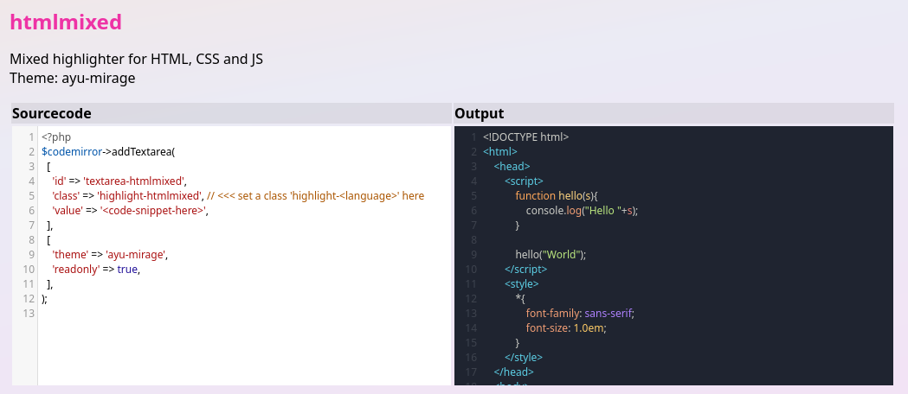
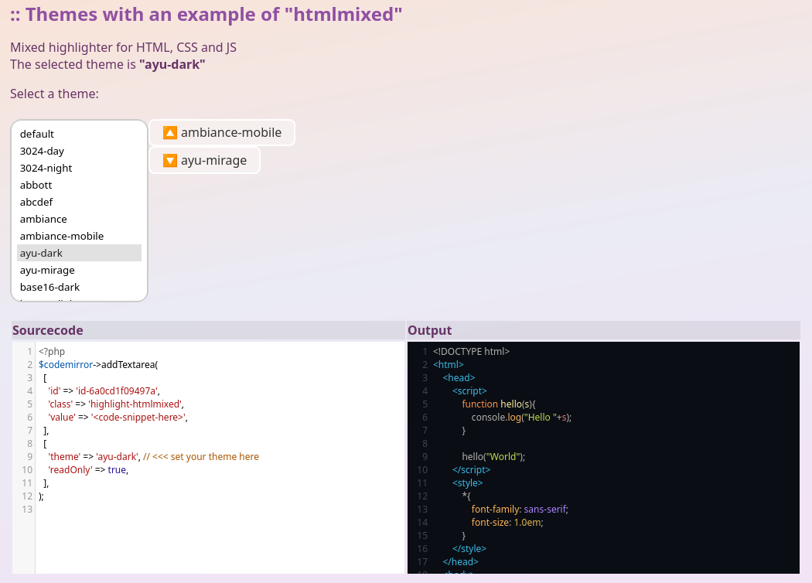

# Axels php class php-codemirror

This class is a helper class for syntax highlighting in a textarea using **Codemirror**.

Multiple instances with different langues and themes are allowed.

**Links**:

* Codemirror Website: <https://codemirror.net/>
* CDN to include the library:
    * CDNJS <https://cdnjs.com/libraries/codemirror>

It is a work in progress. Only a basic subset of Codemirror features is supported. In the first step I needed viewer and editor with syntax highlighting.

👤 Author: Axel Hahn \
📄 Source: https://github.com/axelhahn/php-codemirror \
📜 License: GNU GPL 3.0


## Screenshots






## Try it

### Local php web server

Clone the project

```shell
# FIXME 

git clone https://github.com/axelhahn/php-codemirror.git

cd php-codemirror/examples

# Run the server
php -S localhost:9000
```

In the browser, open the url `http://localhost:9000/`.

## First example for usage

### Include the class

Include class file and initialize an object:

```php
require_once '<classdir>/cm-helper.class.php';
$codemirror=new cmhelper();
```

### Add textarea(s)

To add a textarea with its own syntax highlighting the basic syntax is

```php
$codemirror->addTextarea(
    [array with textarea attributes],
    [array with codemirror options],
);
```
You can repeat it multiple times for several textarea with different options.

**Parameters**:

- array with html attributes for the textarea
  - class {string} - add a class "highlight" + "-" + \<language name\> to load the syntax highlight of a language
  - value {string} - content of the textarea (= your source code to highlight)
  - ... all other textarea attributes
- array with options for codemirror
  - readonly {bool}
  - theme {string}

Example:

```php
$codemirror->addTextarea(
    [
        'class' => 'highlight-htmlmixed',
        'value' => '<your sourcecode to highlight>',
    ],
    [
        'readonly' => true,
        // 'theme' => '...',
    ]
);
```

### Rendering the page

In the page, you can use the method `getHtmlHead()` and `getJs()` to load needed themes, syntax highlighting and codemirror.

```php
$htmlbody='
    <h1>Demo</h1>
    '. $codemirror->addTextarea(
            [
                'class' => 'highlight-htmlmixed',
                'value' => '<your sourcecode to highlight>',
            ],
            [
                'theme' => $aDemo['theme']??null,
                'readonly' => true,
            ]
        );
$sCmHead=$codemirror->getHtmlHead();
$sCmJs=$codemirror->getJs();

echo <<<HTML
<!DOCTYPE html>
<html>
    <head>
        <meta charset="utf-8">
        <meta name="viewport" content="width=device-width, initial-scale=1.0">

        <title>CodeMirror - demo</title>"
        {$sCmHead}

    </head>
    <body>

        {$htmlbody}
        {$sCmJs}

    </body>
</html>
HTML;
```
